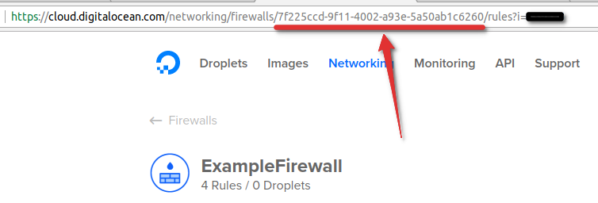

# DigitalOcean Firewall Updater [](LICENSE) [](https://travis-ci.org/paolobarbolini/do-firewall-updater)
_Keep your whitelisted ip address up to date in the digitalocean firewall_

This simple golang program will keep your ip address up to date in the digitalocean firewall, so that you don't have to do it manually.

It's written in golang so that you don't need any dependency, simply download the correct executable for your system from the [releases page](https://github.com/paolobarbolini/do-firewall-updater/releases) to run it on:

* Windows 32 and 64 bit
* macOS 32 and 64 bit
* Linux 32 and 64 bit
* Linux Arm v7 and v8 (the raspberry pi for example)

## Build From Source
Alternatively, if you have a Go environment configured, you can install the development version from the command line like so:

```
$ go get github.com/paolobarbolini/do-firewall-updater
```

## How it works
Every time you run it will remove the ip addresses in the ``old_ips.json`` file from your existing rules and replace them with your current ipv4/6 addresses.

Because of this your current ip address must be already present in the rules which you want to keep up to date with your latest ip address before running this program for the first time.

Your new ip address is then saved in the ``old_ips.json`` file after successfully updating the firewall rules.

It supports both dual stack internet connections and ipv4 or ipv6 only connections.

## Running it
To run it do

```
/path/to/executable --token DIGITALOCEAN_API_TOKEN --firewall-id THE_FIREWALL_ID
```

To generate a new api token go to the [Applications & API section](https://cloud.digitalocean.com/settings/api/tokens) in the digitalocean control panel and create a new personal access token.

The token must have read and write privileges.

You also have to specify the ``--firewall-id`` or the ``--firewall-name`` argument.

If you prefer using the firewall id but you don't know it simply look at the url in your browser while browsing the page to edit an existing firewall.



You can also change the url of the api used to get your public ip address by specifying the ``--ip-api`` argument, by default it uses [http://v4v6.ipv6-test.com/api/myip.php](http://v4v6.ipv6-test.com/api/myip.php).

If you also want to keep your ipv6 address up to date make sure that the api you are using also supports connections from ipv6 addresses.

The api http response body must contain only the ip address, json is not supported.

## Running it regularly
Create a cron job with:

```
crontab -e
*/15 * * * * /path/to/executable --token DIGITALOCEAN_API_TOKEN --firewall-id THE_FIREWALL_ID
```

The example will run every 15 minutes.

If you want to update the same firewall from multiple computers with different connections make sure that the cron job doesn't run at the same time as the other computers to prevent race conditions.
